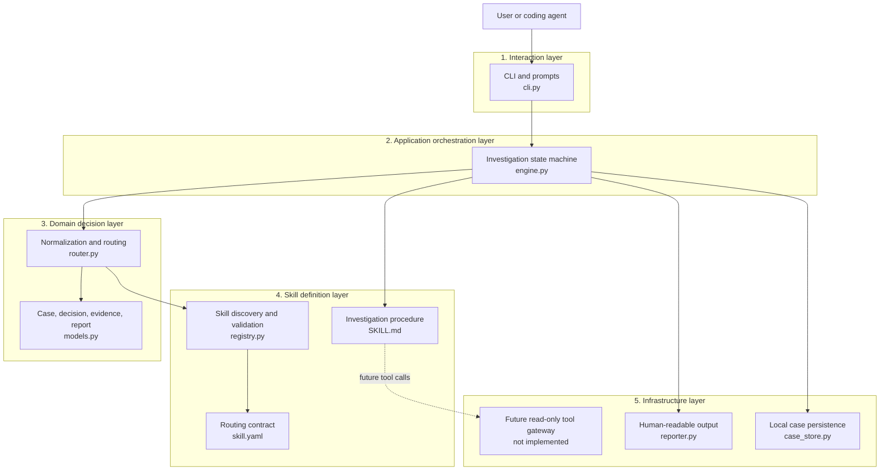

# Local oncall agent design

## 1. Goal

The first version proves one complete control flow: accept a natural-language incident, discover skills, choose the correct skill, collect required context, and produce an evidence-backed report.

## 2. Overall flow

```text
User input
  -> normalize case context
  -> scan and validate skill manifests
  -> score routing candidates
  -> request required context
  -> load the selected SKILL.md
  -> produce and persist an evidence report
```

One agent owns this flow. A visible state machine is used instead of several cooperating agents because the initial case is sequential and small. This keeps decisions reproducible and makes failures easy to locate. Specialist agents can be added later behind the same evidence and state interfaces if parallel investigation becomes useful.

## 3. System layers



Dependencies point downward: interaction invokes the application engine, the engine coordinates domain decisions and skill contracts, and infrastructure handles output and persistence. A skill must not bypass the engine to open arbitrary external connections.

### 3.1 Interaction layer

Accepts a one-shot issue or reads issues in interactive mode. It displays registry errors, asks only for missing required context, and prints the report. It contains no routing or diagnostic policy, allowing another interface to reuse the engine.

### 3.2 Application orchestration layer

`InvestigationEngine` owns the visible transition from intake through routing, context checking, skill loading, and safe stopping. It decides when work may continue and assembles the evidence-backed report without embedding system-specific matching or connection details.

### 3.3 Domain decision layer

Defines the stable case, route, evidence, and report models plus deterministic routing. It normalizes input, scores candidates, preserves readable reasons, separates evidence from conclusions, and returns ambiguity or no-match instead of guessing.

### 3.4 Skill definition layer

Separates machine-readable selection metadata from the investigation procedure. The registry validates manifests without eagerly loading every procedure. The selected `SKILL.md` defines steps and stop conditions; a draft procedure must stop before claiming an investigation occurred.

### 3.5 Infrastructure layer

The implemented infrastructure persists cases as local JSON and formats terminal reports. ClickHouse, MySQL, TCC, and repository access belongs behind the future read-only tool gateway, which will enforce timeouts, result limits, redaction, and consistent evidence records. It is intentionally absent today.

## 4. Skill contract and progressive loading

Each skill has two entry points:

- `skill.yaml` is the program contract. It declares identity, routing signals, required context, lifecycle status, and risk.
- `SKILL.md` is the agent procedure. It will contain investigation steps, evidence requirements, stop conditions, and tool instructions.

Scripts and reference material live in separate directories and are loaded only when a procedure needs them. This avoids parsing free-form Markdown during routing and prevents every schema or script from consuming context for unrelated incidents.

The example skill is marked `draft`. Its Markdown deliberately contains no invented tables, queries, or workflow. Selecting it proves routing only. The engine then stops with `blocked_by_incomplete_skill`, which distinguishes an unfinished procedure from a failed investigation.

## 5. Registry and routing

The registry scans `skills/*/skill.yaml`, validates required fields, checks that the directory and skill ID match, and records invalid entries without crashing the CLI. It stores the path to `SKILL.md` but does not read all procedures during discovery. Manifests intentionally use a small YAML subset containing only top-level strings and string lists. A short standard-library parser keeps the local CLI offline and dependency-free; nested YAML should be introduced only when the contract actually needs it.

The first router is deterministic. System matches carry three points and symptom matches carry two. A candidate needs both kinds of evidence to reach the threshold of five. This prevents a generic phrase such as "data is wrong" from being routed to ClickHouse without a CK signal.

Only one candidate above the threshold is selected. Equal top scores produce an ambiguity result instead of an arbitrary choice. Every score retains human-readable reasons, so routing can be tested and audited. When the skill set grows, semantic retrieval can supply candidates and a model can rerank them without changing `RouteDecision`.

## 6. Context collection and interaction

Routing and execution readiness are separate decisions. A user can identify a ClickHouse issue without initially knowing the environment or time range. The agent therefore selects the skill first, then asks only for required fields that remain missing.

Answers are stored both in typed case fields and in `user_supplied`. Re-running the engine with the same case preserves its ID and continues the same investigation. If a database, table, RDS location, or repository cannot be discovered later, the same rule applies: stop and ask rather than infer it.

## 7. State, evidence, and reports

The minimal states are intake, normalization, routing, context check, skill loading, user-input required, no matching skill, and incomplete skill. Explicit states solve two problems: the CLI can explain why work stopped, and later tool steps can be inserted without hiding control flow inside prompts.

Evidence is a first-class record with an ID, type, summary, source, and timestamp. The current case produces only routing evidence. A report separately records its conclusion and confidence. This prevents the statement "routed to a CK skill" from becoming the unsupported statement "CK data is wrong."

Each case is saved as JSON. Local persistence supports audit, replay, and later skill improvement without requiring a service or database. The runtime directory is ignored by Git so incident data is not committed accidentally.

## 8. Future tool gateway

MySQL, ClickHouse, TCC, and repository access should enter through one tool gateway. Each call should declare its purpose, target, timeout, result limit, and evidence output. SQL must be parsed as read-only rather than accepted by a string-prefix check. ClickHouse queries also need scan limits. Responses should redact secrets and sensitive columns.

## 9. Local metadata catalog

The first version uses files rather than an online metadata service:

```text
metadata/
  catalog.yaml          # confirmed logical mappings committed to Git
  learned.yaml          # mappings confirmed through local user interaction
  candidates.yaml       # unverified or conflicting candidates
  local.example.yaml    # connection-profile template without secrets
  local.yaml            # local connection configuration, ignored by Git
```

`catalog.yaml` and `learned.yaml` map regions and logical resources:

```yaml
regions:
  sg:
    clickhouse:
      profile: ck_sg
      database: analytics_sg
      tables: {event: event_table, ab: ab_table}
    metadata_rds:
      profile: platform_rds_sg
      database: platform_metadata
      tables: {service: service_metadata, datasource: datasource_metadata}
  eu:
    clickhouse:
      profile: ck_eu
      database: analytics_eu
      tables: {event: event_table, ab: ab_table}
```

The catalog stores logical names and profile references, never passwords. `local.yaml` maps profiles such as `ck_sg`, `ck_eu`, and `platform_rds_sg` to local endpoints and environment-variable names. Credentials and tokens come only from environment variables.

### 9.1 Lookup and learning loop

```text
read confirmed catalog
  -> query platform metadata RDS read-only on a miss
  -> ask the user if still missing
  -> use the answer in the current case
  -> append it to learned.yaml with case, time, and confirmer
  -> run a read-only existence check
  -> move failures or conflicts to candidates.yaml for review
```

An explicit user answer may be persisted automatically in `learned.yaml`, so later cases reuse it without asking again. Each entry records `source_case_id`, `learned_at`, `confirmed_by: user`, and optional `validated_at`. Automatic learning never silently overwrites an existing value. Conflicts go to `candidates.yaml`, where the user chooses whether to keep, replace, or split the mapping by environment.

Platform RDS metadata is a query source, not automatically the local source of truth. Evidence records the lookup condition, returned logical identifier, and timestamp so a historical case remains explainable after migrations.

### 9.2 Local read-only ClickHouse queries

The first version wraps an installed `clickhouse-client` or HTTP client behind the tool gateway. A skill submits a structured request containing region/profile, database, logical table, time range, purpose, and result limit. The gateway resolves logical names and executes the query.

The gateway permits only `SELECT`, `EXPLAIN`, `DESCRIBE`, and read-only system-table queries; it rejects multiple statements and DDL/DML. It enforces timeouts, `LIMIT`, scanned-byte limits, and returned-row limits, redacts sensitive columns, and records the SQL digest, cluster, duration, row count, and truncation state as evidence. Skills cannot read connection settings directly or assemble connection commands.

## 10. Deriving skills from cases

A completed case stores the input, selected skill and version, supplied context, tool evidence, conclusion, remediation, and user confirmation. These facts belong to the case first and do not automatically become procedure.

When the user explicitly asks to add the investigation as a skill, the system may:

1. Extract reusable triggers, required context, read-only steps, evidence requirements, and stop conditions.
2. replace request IDs, timestamps, temporary tables, and secrets with parameters or metadata references.
3. Generate `skill.yaml`, `SKILL.md`, and replay tests under `skills/<new-skill-id>/`, always with `draft` status.
4. Show the diff and risks. Promotion to `validated` or `published` requires another user confirmation and passing replay tests.

“Automatically add” authorizes draft generation only, not publication or write operations. Without an explicit user request, the system creates no skill directory. It may mark the case with `skill_candidate: true`, a suggested name, and a reuse rationale, then offer generation when similar patterns recur.

The lifecycle is `draft -> validated -> published -> deprecated`. Reports retain the exact skill ID, version, and content digest used for reproducible historical replay.

## 11. Historical cases and local embedding knowledge

### 11.1 Identifying the skill used by a case

Each case JSON stores `skill_id`, `skill_version`, route candidates, and reasons. The first local knowledge base uses `knowledge/knowledge.db`; SQLite stores case metadata, retrieval text, and embeddings.

Structured fields are optional filters rather than the primary retrieval index. Every result returns its source path, matched chunk, skill ID/version, and similarity for verification. Historical cases are leads, not proof of the current root cause; current evidence must still be collected.

### 11.2 Chunking and indexing

Each indexable case becomes three chunks: `summary` for the symptom and context, `diagnosis` for conclusions and evidence, and `resolution` for next steps and user-supplied information. By default only `completed`, `resolved`, and `success` cases are indexed. Incomplete cases remain as JSON but require `--include-incomplete` to enter retrieval.

Content hashes make indexing idempotent. A changed case or provider is re-embedded. The original case remains authoritative and every result resolves back to it.

### 11.3 Providers and search

`EmbeddingProvider` isolates model implementations. `hashing` is a zero-dependency character n-gram vector fallback for offline tests and approximate lexical retrieval; it is not a high-quality semantic model. `ollama` calls the local `/api/embed` endpoint and is the intended provider for real multilingual semantic use.

Local semantic use configures `ONCALL_EMBEDDING_PROVIDER=ollama` and pins `ONCALL_EMBEDDING_MODEL`. SQLite records provider, model, dimension, and content hash, and never compares vectors from different providers. Search optionally filters region, environment, and system, calculates cosine similarity, and keeps the best chunk per case. Commands cover index, rebuild, search, status, and delete. An LLM wiki may aid reading but never replaces original cases, evidence, skills, or metadata as the source of truth.

## 12. Phased growth path

### First local version

1. Add the YAML metadata catalog, local profiles, and conflict candidates.
2. Implement the read-only ClickHouse/RDS gateway and safety limits.
3. Complete the CK skill with SG/EU and event/AB mock mappings.
4. Add semantic case retrieval with SQLite and a local embedding provider.
5. Generate draft skills only after explicit user authorization.

### Later completeness and online operation

1. At tens of thousands of cases, replace Python brute-force cosine with sqlite-vec, FAISS, or a dedicated vector database.
2. Add hybrid retrieval, reranking, score thresholds, and labeled retrieval evaluation.
3. Add metadata approval, versioning, expiry checks, and multi-user conflict handling.
4. Replace local storage and embedding execution with online services behind the same interfaces.
5. Add authorization, audit, secret management, concurrent jobs, and observability.

This order delivers a useful local loop first and supports later migration to online services.
