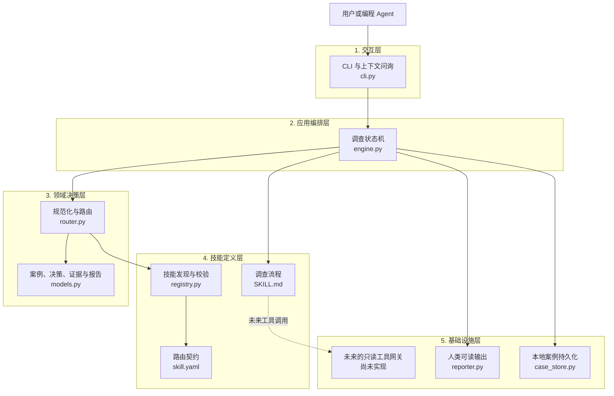

# 本地 Oncall Agent 设计

## 1. 目标

第一版旨在验证一条完整的控制流程：接收自然语言描述的故障事件、发现技能、选择正确的技能、收集所需上下文，并生成有证据支撑的报告。

## 2. 整体流程

```text
用户输入
  -> 规范化案例上下文
  -> 扫描并校验技能清单
  -> 对路由候选项评分
  -> 请求必要上下文
  -> 加载选中的 SKILL.md
  -> 生成并持久化证据报告
```

整个流程由一个 Agent 负责。由于初始案例规模小且按顺序执行，因此采用可见的状态机，而不是多个协作 Agent。这样可以保证决策可复现，也便于定位故障。如果未来并行调查变得有价值，可以在保持相同证据与状态接口的前提下加入专用 Agent。

## 3. 系统分层



依赖方向自上而下：交互层调用应用引擎，引擎协调领域决策和技能契约，基础设施层负责输出与持久化。技能不得绕过引擎任意建立外部连接。

### 3.1 交互层

接收单次命令行故障描述，或在交互模式中持续读取输入；负责展示技能注册错误、只询问缺失的必要上下文，以及输出报告。该层不包含路由或诊断策略，因此其他交互界面也可以复用同一个引擎。

### 3.2 应用编排层

`InvestigationEngine` 负责从接入、路由、上下文检查、技能加载到安全停止的显式状态迁移。它决定工作何时可以继续并组装证据报告，但不内嵌特定系统的匹配规则或连接细节。

### 3.3 领域决策层

定义稳定的案例、路由、证据和报告模型，以及确定性路由行为。它负责规范化输入、对候选项评分、保留可读原因、分离证据与结论，并在歧义或无匹配时停止，而不是猜测。

### 3.4 技能定义层

将机器可读的选择元数据与调查流程分开。注册表校验技能清单，但不会提前加载所有流程。选中的 `SKILL.md` 定义调查步骤和停止条件；草稿流程必须在声称已执行调查之前停止。

### 3.5 基础设施层

当前基础设施把案例持久化为本地 JSON，并格式化终端报告。ClickHouse、MySQL、TCC 和代码仓库访问应放在未来的只读工具网关后，由网关强制执行超时、结果数量限制、脱敏和统一证据记录；当前版本有意尚未实现它。

## 4. 技能契约与渐进式加载

每个技能都有两个入口：

- `skill.yaml` 是程序契约，用于声明标识、路由信号、必要上下文、生命周期状态和风险。
- `SKILL.md` 是 Agent 的操作流程，将包含调查步骤、证据要求、停止条件和工具使用说明。

脚本和参考资料分别存放在独立目录中，仅当操作流程需要时才加载。这样既避免了路由阶段解析自由格式的 Markdown，也防止无关事件加载所有 schema 或脚本、占用上下文。

示例技能被标记为 `draft`。它的 Markdown 刻意不包含任何虚构的表、查询或操作流程。选择该技能只能证明路由正确；随后引擎会以 `blocked_by_incomplete_skill` 状态停止，从而明确区分“操作流程尚未完成”和“调查执行失败”。

## 5. 注册表与路由

注册表扫描 `skills/*/skill.yaml`，校验必填字段，检查目录名是否与技能 ID 一致，并记录无效条目，而不会导致 CLI 崩溃。注册表会保存 `SKILL.md` 的路径，但在发现阶段不会读取所有操作流程。技能清单有意限定为一个小型 YAML 子集，仅包含顶层字符串和字符串列表。使用标准库实现的简短解析器，可以使本地 CLI 保持离线且无外部依赖；只有当契约确实需要时，才应引入嵌套 YAML。

第一版路由器是确定性的：系统匹配得三分，症状匹配得两分。候选项必须同时具备这两类证据，才能达到五分阈值。这样可以避免仅凭“数据不正确”之类的泛化描述，在没有 CK 信号时就路由到 ClickHouse。

阈值以上只会选中一个候选项。如果最高分相同，则返回歧义结果，而不是任意选择。每项得分都会保留便于理解的原因，因此路由可以被测试和审计。当技能集合扩大后，可以使用语义检索提供候选项，再由模型重新排序，而无需改变 `RouteDecision`。

## 6. 上下文收集与交互

路由判断和执行就绪判断是两个独立决策。用户可能已经确认问题与 ClickHouse 有关，但起初并不知道环境或时间范围。因此，Agent 会先选择技能，然后只询问仍然缺失的必填字段。

回答会同时存入类型化案例字段和 `user_supplied`。使用同一案例重新运行引擎时，会保留案例 ID 并继续同一次调查。如果后续无法发现数据库、数据表、RDS 位置或代码仓库，同样遵循这一规则：停止并询问用户，而不是自行推断。

## 7. 状态、证据与报告

最小状态集合包括：接入、规范化、路由、上下文检查、技能加载、需要用户输入、无匹配技能，以及技能未完成。显式状态解决了两个问题：CLI 可以说明工作停止的原因；未来还可以插入工具执行步骤，而不必把控制流程隐藏在提示词中。

证据是一等记录，包含 ID、类型、摘要、来源和时间戳。当前案例只会生成路由证据。报告则单独记录结论和置信度。这样可以防止“已路由到 CK 技能”被错误演变为“CK 数据有误”这一缺乏依据的断言。

每个案例都会保存为 JSON。本地持久化无需服务或数据库，即可支持审计、回放和后续技能改进。运行时目录会被 Git 忽略，防止事件数据被意外提交。

## 8. 未来的工具网关

MySQL、ClickHouse、TCC 和代码仓库访问应统一通过一个工具网关接入。每次调用都应声明用途、目标、超时时间、结果数量限制和证据输出。SQL 必须通过解析确认只读，不能仅依赖字符串前缀检查；ClickHouse 查询还需要扫描量限制。响应应对密钥和敏感字段进行脱敏。

## 9. 本地元数据目录

第一版使用文件目录维护平台元数据，不引入在线元数据服务。建议结构如下：

```text
metadata/
  catalog.yaml          # 已确认、可提交 Git 的逻辑映射
  learned.yaml          # 用户交互中学到并在本机确认的映射
  candidates.yaml       # 尚待验证或存在冲突的候选项
  local.example.yaml    # 本地连接配置模板，不包含密钥
  local.yaml            # 本机连接配置，Git 忽略
```

`catalog.yaml` 和 `learned.yaml` 保存地区、系统和逻辑资源映射，例如：

```yaml
regions:
  sg:
    clickhouse:
      profile: ck_sg
      database: analytics_sg
      tables:
        event: event_table
        ab: ab_table
    metadata_rds:
      profile: platform_rds_sg
      database: platform_metadata
      tables:
        service: service_metadata
        datasource: datasource_metadata
  eu:
    clickhouse:
      profile: ck_eu
      database: analytics_eu
      tables:
        event: event_table
        ab: ab_table
```

目录只保存逻辑名称和连接 profile，不保存密码。`local.yaml` 把 `ck_sg`、`ck_eu`、`platform_rds_sg` 等 profile 映射到本机地址和环境变量名；真实账号、密码和 token 只从环境变量读取。

### 9.1 元数据查找与学习闭环

```text
查询已确认目录
  -> 未命中时只读查询平台 RDS 元数据
  -> 仍未命中则询问用户
  -> 当前 Case 立即使用用户答案
  -> 自动写入 learned.yaml，并记录来源 Case、时间和确认人
  -> 执行只读存在性校验
  -> 校验失败或与已有值冲突时移入 candidates.yaml 并要求复核
```

用户明确回答某个地区、数据库或表的映射后，第一版本地工具可以把它自动写入 `learned.yaml`，后续 Case 优先复用，不再重复询问。自动沉淀必须记录 `source_case_id`、`learned_at`、`confirmed_by: user` 和可选的 `validated_at`。它不能静默覆盖已有值；冲突项进入 `candidates.yaml`，由用户选择保留、替换或按环境拆分。

RDS 中的平台元数据是可查询来源，不直接等同于本地事实源。每次采用 RDS 结果时，应记录查询条件、返回的逻辑标识和时间戳，避免表迁移后无法解释历史 Case 使用了哪个映射。

### 9.2 本地只读查询 ClickHouse

第一版在工具网关后封装本机已有的 `clickhouse-client` 或 HTTP 客户端。技能只提交结构化请求：地区/profile、数据库、逻辑表名、时间范围、查询目的和结果上限；网关负责把逻辑表解析为实际表名并执行查询。

网关必须只允许 `SELECT`、`EXPLAIN`、`DESCRIBE` 和只读系统表查询，拒绝多语句和 DDL/DML；同时设置超时、`LIMIT`、最大扫描字节数和最大返回行数。输出中应脱敏敏感列，并把 SQL 摘要、目标集群、耗时、行数和截断状态写成证据。技能不得直接读取 `local.yaml` 中的连接信息，也不得自行拼接连接命令。

## 10. 从 Case 沉淀 Skill

Case 结束后保存用户描述、选中 Skill 及版本、补充上下文、工具证据、结论、修复动作和用户确认结果。这些内容首先属于 Case，不自动成为长期操作流程。

当用户明确表示“把本次流程新增为 Skill”时，系统可以自动：

1. 从 Case 中提取可复用的触发条件、必要上下文、只读调查步骤、证据要求和停止条件。
2. 删除请求 ID、具体时间、临时表名和密钥等 Case 特有或敏感值，改为元数据引用或参数。
3. 在 `skills/<new-skill-id>/` 生成 `skill.yaml`、`SKILL.md` 和回放测试，状态固定为 `draft`。
4. 展示生成差异和风险；只有用户再次确认发布，且回放测试通过后，才改为 `validated` 或 `published`。

“自动新增”只授权生成草稿，不授权自动发布或执行写操作。如果用户没有明确要求新增 Skill，系统不得创建技能目录；它只在 Case 中记录 `skill_candidate: true`、建议名称和复用理由。相似模式重复出现后可以提醒用户是否生成 Skill，但默认答案仍是不生成。

技能生命周期为 `draft -> validated -> published -> deprecated`。报告必须记录实际使用的 Skill ID、版本和内容摘要，以便历史回放不受后续修改影响。

## 11. 历史 Case 与本地 Embedding 知识库

### 11.1 如何定位历史 Case 使用的 Skill

每个 Case JSON 直接保存 `skill_id`、`skill_version`、路由候选及原因。第一版本地知识库使用 `knowledge/knowledge.db`，其中 SQLite 保存 Case 元数据、检索文本和 embedding：

- `case_id`、创建时间、地区、环境和系统；
- 规范化症状、Skill ID/版本和最终状态；
- 涉及的服务、数据库、表和错误码；
- 结论摘要、置信度、标签和原始 Case 文件路径。

结构化字段不再承担主要召回，而只作为 embedding 检索前的可选过滤条件，例如地区、环境和系统。每个结果必须返回原始 Case 路径、匹配片段、Skill ID/版本和相似度，以便回源验证。历史 Case 只能作为调查线索，不能直接证明当前根因；关键结论仍需重新获取当前证据。

### 11.2 文档切分与索引

每个可索引 Case 被规范化为三个 chunk：

- `summary`：原始描述、规范化现象、环境、时间范围、实体和 Skill。
- `diagnosis`：结论、置信度和证据。
- `resolution`：后续步骤和用户补充。

默认只索引 `completed`、`resolved` 和 `success` Case。未完成、无匹配或被 draft Skill 阻塞的 Case 仍保留原始 JSON，但不进入已解决知识召回，除非显式使用 `--include-incomplete`。索引使用内容 hash 实现幂等更新；Case 或 embedding provider 变化时重新生成三个 chunk。

### 11.3 Embedding provider 与查询

`EmbeddingProvider` 隔离模型实现。第一版提供：

- `hashing`：零依赖的字符 n-gram 向量，适合离线测试和关键词近似召回，但不应被视为高质量语义模型。
- `ollama`：通过本地 Ollama `/api/embed` 使用真实 embedding 模型，适合中文和中英文混合语义检索。

生产式本地使用应配置 `ONCALL_EMBEDDING_PROVIDER=ollama` 和固定的 `ONCALL_EMBEDDING_MODEL`。SQLite 记录 provider、模型名、向量维度和内容 hash，不允许不同模型的向量混合计算。查询先应用可选的 region/environment/system 过滤，再对候选 chunk 做余弦相似度计算，并按每个 Case 的最高分聚合。

支持 `index`、`rebuild`、`search`、`status` 和 `delete`。删除原始 Case 或切换模型后必须重建或显式删除旧索引。LLM Wiki 可以作为人工阅读摘要，但不能替代原始 Case、证据、Skill 和元数据这些事实源。

## 12. 分阶段演进路径

### 第一版本地可用

1. 建立 YAML 元数据目录、local profile 和冲突候选机制。
2. 实现只读 ClickHouse/RDS 工具网关及安全限制。
3. 补全 CK Skill，并用 SG/EU、event/AB 表的模拟映射测试。
4. 使用 SQLite 和本地 embedding provider 建立 Case 语义索引。
5. 实现“用户明确授权后生成 draft Skill”的流程。

### 后续完备性与在线化

1. 当 Case 达到数万级时，以 sqlite-vec、FAISS 或专用向量数据库替换 Python 暴力余弦计算。
2. 增加混合召回、reranker、相似度阈值和基于标注 Case 的召回质量评估。
3. 增加元数据审批、版本、过期检测和多人冲突处理。
4. 把本地文件存储与 embedding 服务替换为在线服务，同时保留相同领域接口。
5. 增加权限、审计、密钥管理、并发任务和可观测性。

这一顺序优先完成真实可用的本地闭环，并支持后续迁移到在线服务。
